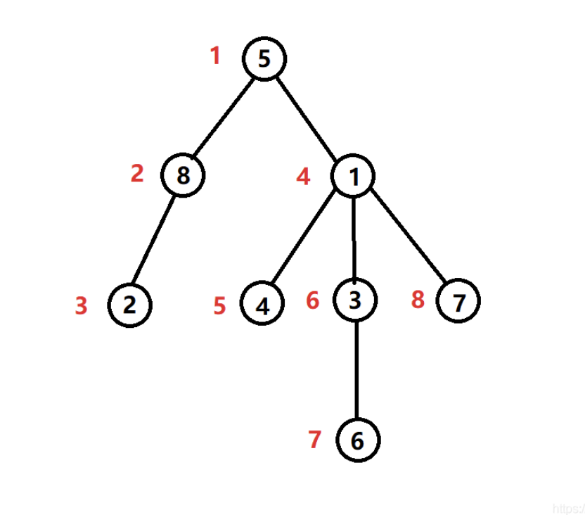

# 树型dp-下

## Slide 1: 树型dp-下

- 前置知识
- 讲解059 - 链式前向星建图
- 讲解073 - 01背包，本节课题目5需要
- 讲解078 - 树型dp-上
- 【必备】课程的动态规划大专题从讲解066开始，建议从头开始学习会比较系统
- 上节课
- 讲述了几道经典树型dp问题，熟悉了树型dp的解题套路
- 本节课
- 见识更多树型dp问题(题目1、2)
- 树上dfn序和相关题目(题目3、4、5)
- 本节课的题目5，树上01背包，推荐掌握最优解

- 左程云

## Slide 2: 树型dp-下

- 题目1
- 到达首都的最少油耗
- 给你一棵 n 个节点的树（一个无向、连通、无环图）
- 每个节点表示一个城市，编号从 0 到 n - 1 ，且恰好有 n - 1 条路，0 是首都
- 给你一个二维整数数组 roads
- 其中 roads[i] = [ai, bi] ，表示城市 ai 和 bi 之间有一条 双向路
- 每个城市里有一个代表，他们都要去首都参加一个会议
- 每座城市里有一辆车。给你一个整数 seats 表示每辆车里面座位的数目
- 城市里的代表可以选择乘坐所在城市的车，或者乘坐其他城市的车
- 相邻城市之间一辆车的油耗是一升汽油
- 请你返回到达首都最少需要多少升汽油
- 测试链接 :
- https://leetcode.cn/problems/minimum-fuel-cost-to-report-to-the-capital/

- 左程云

## Slide 3: 树型dp-下

- 题目2
- 相邻字符不同的最长路径
- 给你一棵 树（即一个连通、无向、无环图），根节点是节点 0
- 这棵树由编号从 0 到 n - 1 的 n 个节点组成
- 用下标从 0 开始、长度为 n 的数组 parent 来表示这棵树
- 其中 parent[i] 是节点 i 的父节点
- 由于节点 0 是根节点，所以 parent[0] == -1
- 另给你一个字符串 s ，长度也是 n ，其中 s[i] 表示分配给节点 i 的字符
- 请你找出路径上任意一对相邻节点都没有分配到相同字符的 最长路径
- 并返回该路径的长度
- 测试链接 :
- https://leetcode.cn/problems/longest-path-with-different-adjacent-characters/

- 左程云

## Slide 4: 树型dp-下

- dfn序
- 用深度优先遍历的方式遍历整棵树
- 给每个节点依次标记序号
- 编号从小到大的顺序就是dfn序
- dfn序 + 每颗子树的大小，可以起到定位子树节点的作用
- 如果某个节点的dfn序号是x，以这个节点为头的子树大小为y
- 那么可知，dfn序号从x ~ x+y-1所代表的节点，都属于这个节点的子树
- 利用这个性质， 节点间的关系判断（题目3、4），跨子树的讨论（题目5） 就会变得方便
- dfn序除了和树型dp相关，后续还和很多算法数据结构有关（树链剖分等）
- 后续内容会在【扩展】、【挺难】课程里安排讲述

- 左程云

## Slide 5: 树型dp-下

- 题目3（dfn序相关）
- 移除子树后的二叉树高度
- 给你一棵 二叉树 的根节点 root ，树中有 n 个节点
- 每个节点都可以被分配一个从 1 到 n 且互不相同的值，另给你一个长度为 m 的数组 queries
- 你必须在树上执行 m 个 独立 的查询，其中第 i 个查询你需要执行以下操作：
- 从树中 移除 以 queries[i] 的值作为根节点的子树
- 题目所用测试用例保证 queries[i] 不等于根节点的值
- 返回一个长度为 m 的数组 answer，其中 answer[i] 是执行第 i 个查询后树的高度
- 注意：查询之间是独立的，所以在每个查询执行后，树会回到其初始状态
- 树的高度是从根到树中某个节点的 最长简单路径中的边数
- 测试链接 : https://leetcode.cn/problems/height-of-binary-tree-after-subtree-removal-queries/

- 左程云

## Slide 6: 树型dp-下

- 题目4（dfn序相关）
- 从树中删除边的最小分数
- 存在一棵无向连通树，树中有编号从0到n-1的n个节点，以及n-1条边
- 给你一个下标从0开始的整数数组nums长度为n，其中nums[i]表示第i个节点的值
- 另给你一个二维整数数组edges长度为n-1
- 其中 edges[i] = [ai, bi] 表示树中存在一条位于节点 ai 和 bi 之间的边
- 删除树中两条不同的边以形成三个连通组件，对于一种删除边方案，定义如下步骤以计算其分数：
- 分别获取三个组件每个组件中所有节点值的 异或值（讲解030 - 异或运算）
- 最大 异或值和 最小 异或值的 差值 就是这种删除边方案的分数
- 返回可能的最小分数
- 测试链接 : https://leetcode.cn/problems/minimum-score-after-removals-on-a-tree/
- 掌握O(n^2)的解即可，时间复杂度更好的解分析过程非常繁琐，用到启发式合并
- 不具备教学意义，有兴趣的同学可以研究

- 左程云

## Slide 7: 树型dp-下

- 题目5
- 选课，树上01背包
- 在大学里每个学生，为了达到一定的学分，必须从很多课程里选择一些课程来学习
- 在课程里有些课程必须在某些课程之前学习，如高等数学总是在其它课程之前学习
- 现在有 N 门功课，每门课有个学分，每门课有一门或没有直接先修课
- 若课程 a 是课程 b 的先修课即只有学完了课程 a，才能学习课程 b
- 一个学生要从这些课程里选择 M 门课程学习，返回能获得的最大学分
- 测试链接 : https://www.luogu.com.cn/problem/P2014
- 普通解法时间复杂度O(n * 每个节点的孩子平均数量 * m的平方)
- 最优解的时间复杂度O(n * m)，dfn序的利用 + 巧妙定义下的尝试，尤其理解 有效结构 ！
- 推荐掌握最优解！

- 左程云
