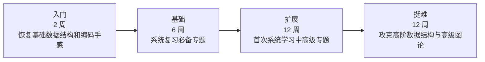

# Algorithm Journey 课程门户

这个站点用于整理 `algorithm-journey` 的 C++ 学习路径、阶段大纲与后续教程文档。

## 课程定位

- 面向希望系统学习算法与数据结构的 C++ 学习者
- `src/` 中的 Java 代码只作为题目来源和参考实现入口
- 课程讲解、模板整理、解题表达统一使用 C++
- 当前先建设课程大纲，后续再逐课展开教程正文

## 学习路径图



## 阶段概览

<div class="grid cards" markdown>

- __入门__

  ---

  适合快速恢复基础算法和常见模板。

  [进入入门阶段](plan/intro.md)

- __基础__

  ---

  建立 `必备` 主干知识体系与高频题型认知。

  [进入基础阶段](plan/foundation.md)

- __扩展__

  ---

  首次系统学习字符串、线段树、树上专题、DP 优化、数论深化。

  [进入扩展阶段](plan/extension.md)

- __挺难__

  ---

  学习高级数据结构、离线算法、树分治和连通性分解。

  [进入挺难阶段](plan/hard.md)

</div>

## 快速跳转

- [课程总览](plan/overview.md)
- [入门阶段](plan/intro.md)
- [基础阶段](plan/foundation.md)
- [扩展阶段](plan/extension.md)
- [挺难阶段](plan/hard.md)

## 本地预览

```bash
uv run mkdocs serve
```

构建静态站点：

```bash
uv run mkdocs build
```

## 数学公式示例

行内公式：$O(n \log n)$、$lowbit(x) = x \& (-x)$。

$$
\sum_{i=1}^{n} i = \frac{n(n+1)}{2}
$$
